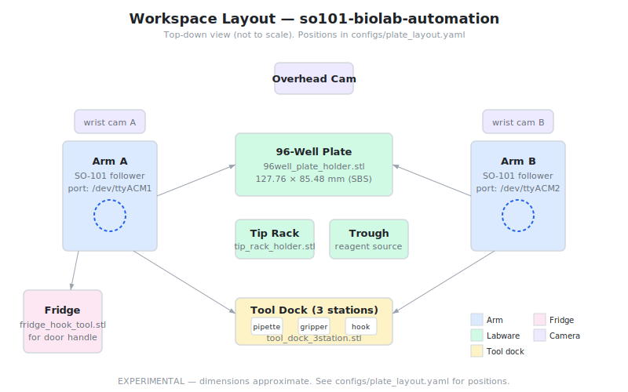

# so101-biolab-automation

[](LICENSE)

[](https://github.com/qte77/so101-biolab-automation/actions/workflows/codeql.yaml)
[](https://www.codefactor.io/repository/github/qte77/so101-biolab-automation)
[](https://github.com/qte77/so101-biolab-automation/actions/workflows/ruff.yaml)
[](https://github.com/qte77/so101-biolab-automation/actions/workflows/pytest.yaml)
[](https://github.com/qte77/so101-biolab-automation/actions/workflows/links-fail-fast.yaml)

[](https://uithub.com/qte77/so101-biolab-automation)
[](https://gittodoc.com/qte77/so101-biolab-automation)
[](https://vscode.dev/github/qte77/so101-biolab-automation)
[](https://github.com/codespaces/new?repo=qte77/so101-biolab-automation)

Dual SO-101 robotic arm bio-lab automation: 96-well pipetting, tool changing, remote oversight.

## What This Demonstrates

- **Teacher-student learning** — Leader arm teaches follower via imitation learning (ACT policy)
- **Coordinate commands** — Direct well-to-well pipetting by coordinate grid
- **Remote oversight** — WebRTC camera feeds + WebSocket command injection from browser
- **Tool changing** — Arms swap between pipette, gripper, and fridge hook autonomously

## Hardware

Two [SO-101](https://github.com/therobotstudio/so-arm100) follower arms + one leader arm, controlled via [LeRobot](https://huggingface.co/docs/lerobot/index). ~$350–$650 depending on config. See [docs/hardware/BOM.md](docs/hardware/BOM.md) for full shopping list with links.

## Quick Start

```bash
# Setup
make setup

# Generate 3D-printed parts (OpenSCAD)
make setup_scad
make render_scad

# Optional: validate printability (PrusaSlicer)
make setup_slicer
make check_prints

# Calibrate arms
make calibrate

# Teleoperate (teacher-student)
make teleop

# Record pipetting episodes
make record TASK="pipette row A"

# Train policy
make train

# Run demo
make demo
```

## Architecture



See [docs/architecture.md](docs/architecture.md) for full system design, module responsibilities, and data flows.

## Project Structure

```
src/biolab/        Core: arm control, pipette, plate coords, tool changer, safety, workflow
src/dashboard/     FastAPI server, WebSocket commands, browser UI
scripts/           CLI entry points for use cases and demo orchestration
configs/           Arm ports, plate layout, tool dock positions (YAML)
hardware/scad/     OpenSCAD parametric scripts (primary STL+SVG generation)
hardware/cad/      CadQuery scripts for 3D-printed parts (fallback)
hardware/slicer/   PrusaSlicer CLI printability validation (optional)
hardware/stl/      Generated STL files (via make render_scad, gitignored)
hardware/svg/      SVG 2D projections of parts (tracked, for documentation)
docs/              Architecture, user stories, demo scenarios, BOM, research
tests/             104 tests across 11 test files
```

## Documentation

- [Architecture](docs/architecture.md) — system design, module responsibilities, data flows
- [User Stories](docs/UserStory.md) — UC1-4 acceptance criteria
- [Demo Scenarios](docs/demo-scenarios.md) — how to run and verify each use case
- [Hardware BOM](docs/hardware/BOM.md) — shopping list with links ($350-$820)
- [Research](docs/research.md) — community designs, papers, future vision (VLM, embodied AI)

## Key Dependencies

- [LeRobot](https://github.com/huggingface/lerobot) — Teleoperation + imitation learning
- [PyLabRobot](https://github.com/PyLabRobot/pylabrobot) — Liquid handling abstractions
- [digital-pipette-v2](https://github.com/ac-rad/digital-pipette-v2) — 3D-printed pipette reference
- [OpenSCAD](https://openscad.org/) — Parametric CAD for 3D-printed parts
- [PrusaSlicer](https://github.com/prusa3d/PrusaSlicer) — Printability validation (optional)
- FastAPI + WebRTC — Remote dashboard
- OpenCV — Camera pipeline

## License

Apache-2.0
