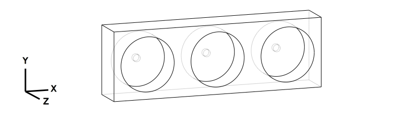
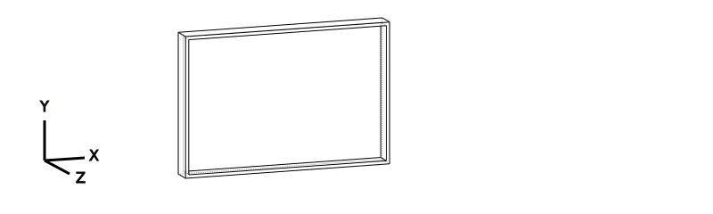
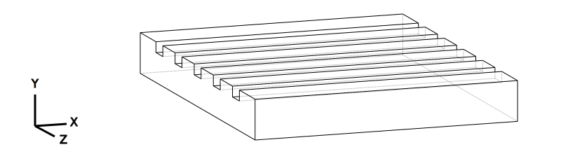
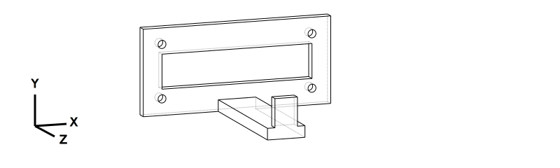

# Hardware Parts

Generated from `parts.json` manifest via `render.py` (build123d preferred, OpenSCAD fallback).

```bash
make setup_cad            # Install build123d (preferred)
make setup_scad           # Install OpenSCAD (fallback)
make render_parts         # Generate STL + SVG from parts.json
make setup_slicer         # Install slicer (optional)
make check_prints         # Check printability
make render_all           # Generate + validate
```

**How it works:** `hardware/parts.json` defines all parts (names, filenames, scripts, build functions). `hardware/render.py` reads the manifest and dispatches to build123d (imports `build_func`, exports STL+SVG) or OpenSCAD (CLI calls with `scad_args`). Adding a part means editing `parts.json` and writing the script.

**Why build123d + slicer?** build123d generates parametric STLs with isometric wireframe SVGs. A slicer (CuraEngine / PrusaSlicer) validates FDM printability (overhangs, unsupported regions, gravity failures) as fast CLI feedback.

**Status:** EXPERIMENTAL = draft dimensions, untested on hardware.

Generated STL/SVG outputs and reference scans live under the top-level `../../hardware/` directory; only code lives here. See [../../docs/architecture.md](../../docs/architecture.md#hardware-asset-layout) for the authoritative layout description.

## System Overview


## Print Settings

| Setting | Default | Exception |
|---------|---------|-----------|
| Material | PLA+ | `gripper_tips_tpu.stl` → TPU 95A |
| Nozzle | 0.4mm | — |
| Layer height | 0.2mm | prototype profile → 0.3mm |
| Infill | 15% | functional parts (dpette mounts, tool changer) → 25% |
| Supports | >45° | disabled by default |

Slicer profiles (`slicer/profiles/*.ini`):

- **Generic:** `pla_plus_02mm.ini`, `tpu_95a_02mm.ini` — printer-agnostic
- **Prusa MK4:** `prusa_mk4_pla_02mm.ini` (production), `prusa_mk4_pla_prototype.ini` (fast fit-check), `prusa_mk4_pla_prototype_supports.ini` (with auto-supports), `prusa_mk4_tpu_02mm.ini` (gripper tips on MK4)

Upload to an Original Prusa MK4 via PrusaLink — see [../../docs/hardware/prusa-mk4-ops.md](../../docs/hardware/prusa-mk4-ops.md) for the endpoint reference + curl examples.

## Parts & Assembly

### Tool Changer System

Passive tool changing based on [Berkeley design](https://goldberg.berkeley.edu/pubs/CASE2018-ron-tool-changer-submitted.pdf) (truncated cone + dowel pins + magnets).

| Part | Preview |
|------|---------|
| Robot-side cone (female) |  |
| Tool-side cone — pipette |  |
| Tool-side cone — gripper |  |
| 3-station dock |  |

**Assembly order:**

1. **`tool_cone_robot.stl`** — Mount on SO-101 wrist (motor 5 horn, 4× M3 screws). Stays on arm permanently.
2. **`tool_cone_pipette/gripper.stl`** — Attach one to each tool. Glue or screw to tool base.
3. **`tool_dock_3station.stl`** — Fix to workspace. Insert 5mm neodymium magnets in each slot bottom.

**Tool change sequence:** Approach dock → insert tool → retract → move to new slot → push onto cone → retract with new tool.

### Pipette Setup

| Part | Preview |
|------|---------|
| Pipette mount |  |

1. **`pipette_mount_so101.stl`** — Clamp around dPette barrel. Tighten with 2× M3 screws.
2. Attach `tool_cone_pipette.stl` to mount base (4× M3 or glue).
3. **`tip_rack_holder.stl`** — Place on workspace, insert tip rack. Arm picks tips by pressing pipette into rack.

| Part | Preview |
|------|---------|
| Tip rack holder |  |

### Plate Handling

| Part | Preview |
|------|---------|
| 96-well plate holder |  |

1. **`96well_plate_holder.stl`** — Place at known position. 4 alignment pins locate the plate.

### Gripper Enhancement

| Part | Preview |
|------|---------|
| Gripper tips (TPU) |  |

1. **`gripper_tips_tpu.stl`** — Press-fit or glue onto SO-101 gripper fingers. Print in TPU 95A.

### dPette+ 8-Channel Mount (replaces SO-101 gripper jaws)

Derived from a 1:1 mm Revopoint 3D scan of the DLAB dPette+ handle (see [Scan Reference Data](#scan-reference-data)). Replaces the stock gripper jaws with a dedicated dPette+ mount:

| Part | Preview |
|------|---------|
| Pipette clamp (replaces bottom jaw) |  |
| Ejector lever (replaces top jaw) |  |
| Tip ejector station |  |

**Assembly:**

1. **`dpette_multi_handle.stl`** — Bolts to M5 horn (4× M3 on 20mm BC). Ø32mm split bore clamps the round dPette+ handle; 2× M3 pinch bolts tension the clamp.
2. **`dpette_ejector_lever.stl`** — Bolts to M6 horn (25T spline + 4× M2 on 16mm BC). When M6 rotates (gripper-close motion), the 20mm arm sweeps and pushes down on the ejector hook (~175N from 35 kg-cm stall torque).
3. **`dpette_tip_release.stl`** — L-bracket tip ejector station at a fixed waste position. Robot moves pipette laterally into the horizontal finger to trigger tip ejection; wide waste slot fits both single- and 8-channel tip falls.

### dPette Single-Channel Mount (alternative)

| Part | Preview |
|------|---------|
| U-bracket handle |  |
| Cam arm |  |

1. **`dpette_handle.stl`** — U-bracket (single-sided C-frame): top bar bolts to M5 horn, vertical side holds M6 motor, bottom bar clamps the dPette 7016 single-channel barrel (Ø20mm bore + pinch bolt split).
2. **`dpette_cam_arm.stl`** — Straight radial arm on M6 horn. Sweeps into the ejector hook when M6 rotates.

## Scan Reference Data

Parametric CAD scripts in `cad/dpette/` may be informed by 3D scan data (structured-light scanners like Revopoint) when a physical reference is available. Scans live at the top-level `../../hardware/scans/` directory, **separate** from generated STL/SVG outputs.

Current scans:

| File | Size | Derived parts |
|---|---|---|
| [`../../hardware/scans/dpette/0410_02_mesh.ply`](../../hardware/scans/dpette/0410_02_mesh.ply) | ~2.3 MB | `dpette_multi_handle`, `dpette_ejector_lever` |
| [`../../hardware/scans/dpette/0410_02_mesh.stl`](../../hardware/scans/dpette/0410_02_mesh.stl) | ~4.6 MB | (same; mesh conversion of the PLY above) |

Parts derived from a scan carry an optional `scan_source` field in `parts.json` pointing at the scan file — queryable for tool-genesis workflows and design audits. See [../../hardware/scans/dpette/README.md](../../hardware/scans/dpette/README.md) for provenance and scale.

## Parts Catalog

The machine-readable manifest of all parts (name, STL/SVG outputs, CAD source, build function, status, backend, scan source) is [`parts.json`](parts.json). It is the single source of truth — `render.py` reads it to generate outputs, tests validate it, and this README links to it rather than duplicating it.

Query examples:

```bash
# List all active parts
jq '.[] | select(.status == "active") | .name' app/hardware/parts.json

# Find scan-derived parts
jq '.[] | select(.scan_source) | {name, scan_source}' app/hardware/parts.json
```

## Structural Review Checklist

Before printing, verify each STL:

- [ ] **Mesh integrity** — run `python hardware/slicer/validate.py --all --structural` (checks triangle count, file size)
- [ ] **Connected geometry** — no floating/disconnected features (open in slicer preview, rotate all angles)
- [ ] **Minimum wall thickness** — 0.8mm for 0.4mm nozzle (2 perimeters minimum)
- [ ] **Overhangs** — no unsupported angles > 45° (or add supports)
- [ ] **Bed adhesion** — flat bottom face exists (no point/edge contact)
- [ ] **Fit check** — mating dimensions match hardware (servo horns, magnets, pipette barrel)

## Hardware Needed (Non-Printed)

- 5mm × 3mm neodymium magnets (3 for dock, 4 for cone pairs)
- M3 × 8mm screws (4 for wrist mount, 2 per pipette clamp)
- Glue (CA or epoxy) for cone-to-tool bonding
