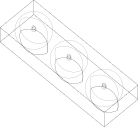
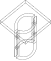
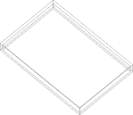
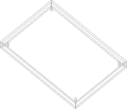

# Hardware Parts

Generated from `parts.json` manifest via `render.py` (build123d preferred, OpenSCAD fallback).

```bash
make setup_cad            # Install build123d (preferred)
make setup_scad           # Install OpenSCAD (fallback)
make render_parts         # Generate STL + SVG from parts.json
make setup_slicer         # Install slicer (optional)
make check_prints         # Check printability
make render_all           # Generate + validate
```

**How it works:** `hardware/parts.json` defines all parts (names, filenames, scripts, build functions). `hardware/render.py` reads the manifest and dispatches to build123d (imports `build_func`, exports STL+SVG) or OpenSCAD (CLI calls with `scad_args`). Adding a part means editing `parts.json` and writing the script.

**Why build123d + slicer?** build123d generates parametric STLs with isometric wireframe SVGs. A slicer (CuraEngine / PrusaSlicer) validates FDM printability (overhangs, unsupported regions, gravity failures) as fast CLI feedback.

**Status:** EXPERIMENTAL = draft dimensions, untested on hardware.

## System Overview


## Print Settings

| Setting | Default | Exception |
|---------|---------|-----------|
| Material | PLA+ | `gripper_tips_tpu.stl` → TPU 95A |
| Nozzle | 0.4mm | — |
| Layer height | 0.2mm | — |
| Infill | 15% | — |
| Supports | >45° | — |

## Parts & Assembly

### Tool Changer System

Passive tool changing based on [Berkeley design](https://goldberg.berkeley.edu/pubs/CASE2018-ron-tool-changer-submitted.pdf) (truncated cone + dowel pins + magnets).

| Part | Preview |
|------|---------|
| Robot-side cone (female) |  |
| Tool-side cone — pipette |  |
| Tool-side cone — gripper |  |
| 3-station dock |  |

**Assembly order:**

1. **`tool_cone_robot.stl`** — Mount on SO-101 wrist (motor 5 horn, 4× M3 screws). Stays on arm permanently.
2. **`tool_cone_pipette/gripper.stl`** — Attach one to each tool. Glue or screw to tool base.
3. **`tool_dock_3station.stl`** — Fix to workspace. Insert 5mm neodymium magnets in each slot bottom.

**Tool change sequence:** Approach dock → insert tool → retract → move to new slot → push onto cone → retract with new tool.

### Pipette Setup

| Part | Preview |
|------|---------|
| Pipette mount |  |

1. **`pipette_mount_so101.stl`** — Clamp around dPette barrel. Tighten with 2× M3 screws.
2. Attach `tool_cone_pipette.stl` to mount base (4× M3 or glue).
3. **`tip_rack_holder.stl`** — Place on workspace, insert tip rack. Arm picks tips by pressing pipette into rack.

| Part | Preview |
|------|---------|
| Tip rack holder |  |

### Plate Handling

| Part | Preview |
|------|---------|
| 96-well plate holder |  |

1. **`96well_plate_holder.stl`** — Place at known position. 4 alignment pins locate the plate.

### Gripper Enhancement

| Part | Preview |
|------|---------|
| Gripper tips (TPU) |  |

1. **`gripper_tips_tpu.stl`** — Press-fit or glue onto SO-101 gripper fingers. Print in TPU 95A.

## Parts Table

| STL File | SVG | Source | Description |
|----------|-----|--------|-------------|
| `tool_cone_robot.stl` | [svg](svg/so101/tool_cone_robot.svg) | `cad/so101/tool_changer.py` | Female cone — mounts on SO-101 wrist |
| `tool_cone_pipette.stl` | [svg](svg/so101/tool_cone_pipette.svg) | `cad/so101/tool_changer.py` | Male cone — pipette tool base |
| `tool_cone_gripper.stl` | [svg](svg/so101/tool_cone_gripper.svg) | `cad/so101/tool_changer.py` | Male cone — gripper tool base |
| `tool_dock_3station.stl` | [svg](svg/so101/tool_dock_3station.svg) | `cad/so101/tool_dock.py` | 3-slot parking rack with magnet pockets |
| `pipette_mount_so101.stl` | [svg](svg/so101/pipette_mount_so101.svg) | `cad/so101/pipette_mount.py` | dPette barrel clamp for SO-101 wrist |
| `gripper_tips_tpu.stl` | [svg](svg/so101/gripper_tips_tpu.svg) | `cad/so101/gripper_tips.py` | Compliant fingertips (TPU 95A) |
| `96well_plate_holder.stl` | [svg](svg/labware/96well_plate_holder.svg) | `cad/labware/plate_holder.py` | SBS plate holder with alignment pins |
| `tip_rack_holder.stl` | [svg](svg/labware/tip_rack_holder.svg) | `cad/labware/tip_rack_holder.py` | Tip rack tray |
| `dpette_single_cradle.stl` | [svg](svg/dpette/dpette_single_cradle.svg) | `cad/dpette/dpette_cradle.py` | Rest cradle for dPette 7016 |
| `dpette_multi_cradle.stl` | [svg](svg/dpette/dpette_multi_cradle.svg) | `cad/dpette/dpette_cradle.py` | Rest cradle for dPette+ 8-channel |
| `tip_ejection_bar.stl` | [svg](svg/dpette/tip_ejection_bar.svg) | `cad/dpette/tip_ejection_bar.py` | Tip ejection post (top-button) |

## Structural Review Checklist

Before printing, verify each STL:

- [ ] **Mesh integrity** — run `python hardware/slicer/validate.py --all --structural` (checks triangle count, file size)
- [ ] **Connected geometry** — no floating/disconnected features (open in slicer preview, rotate all angles)
- [ ] **Minimum wall thickness** — 0.8mm for 0.4mm nozzle (2 perimeters minimum)
- [ ] **Overhangs** — no unsupported angles > 45° (or add supports)
- [ ] **Bed adhesion** — flat bottom face exists (no point/edge contact)
- [ ] **Fit check** — mating dimensions match hardware (servo horns, magnets, pipette barrel)

## Hardware Needed (Non-Printed)

- 5mm × 3mm neodymium magnets (3 for dock, 4 for cone pairs)
- M3 × 8mm screws (4 for wrist mount, 2 per pipette clamp)
- Glue (CA or epoxy) for cone-to-tool bonding
