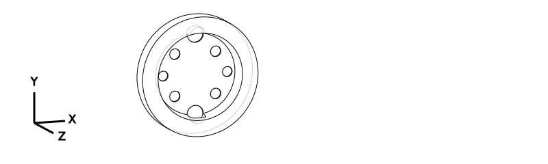
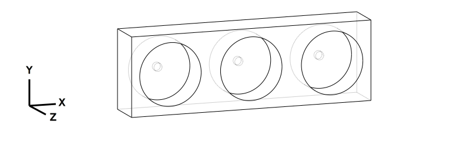
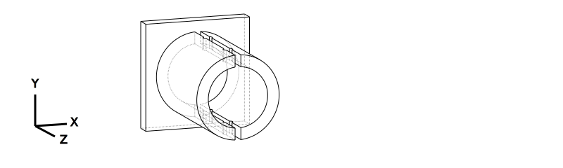
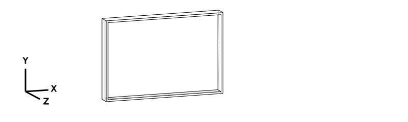
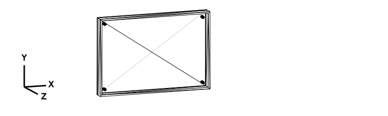

# STL Files

Generated from CadQuery scripts in `../cad/`. Run `make render_parts` to regenerate (requires Python 3.10 + `make setup_cad`).

**Status:** EXPERIMENTAL = draft dimensions, untested on hardware.

## System Overview

## Print Settings

| Setting | Default | Exception |
|---------|---------|-----------|
| Material | PLA+ | `gripper_tips_tpu.stl` → TPU 95A |
| Nozzle | 0.4mm | — |
| Layer height | 0.2mm | — |
| Infill | 15% | — |
| Supports | >45° | — |

## Parts & Assembly

### Tool Changer System

Passive tool changing based on [Berkeley design](https://goldberg.berkeley.edu/pubs/CASE2018-ron-tool-changer-submitted.pdf) (truncated cone + dowel pins + magnets).

| Part | Preview |
|------|---------|
| Robot-side cone (female) |  |
| Tool-side cone (male) |  |
| 3-station dock |  |

**Assembly order:**

1. **`tool_cone_robot.stl`** — Mount on SO-101 wrist (motor 5 horn, 4× M3 screws). Stays on arm permanently.
2. **`tool_cone_pipette/gripper/hook.stl`** — Attach one to each tool. Glue or screw to tool base.
3. **`tool_dock_3station.stl`** — Fix to workspace. Insert 5mm neodymium magnets in each slot bottom.

**Tool change sequence:** Approach dock → insert tool → retract → move to new slot → push onto cone → retract with new tool.

### Pipette Setup

| Part | Preview |
|------|---------|
| Pipette mount |  |

1. **`pipette_mount_so101.stl`** — Clamp around [digital-pipette-v2](https://github.com/ac-rad/digital-pipette-v2) barrel. Tighten with 2× M3 screws.
2. Attach `tool_cone_pipette.stl` to mount base (4× M3 or glue).
3. **`tip_rack_holder.stl`** — Place on workspace, insert tip rack. Arm picks tips by pressing pipette into rack.

| Part | Preview |
|------|---------|
| Tip rack holder |  |

### Plate Handling

| Part | Preview |
|------|---------|
| 96-well plate holder |  |

1. **`96well_plate_holder.stl`** — Place at known position. 4 alignment pins locate the plate.

### Fridge Operations

| Part | Preview |
|------|---------|
| Fridge hook |  |

1. **`fridge_hook_tool.stl`** — Attach `tool_cone_hook.stl` to flat mount face. Hook fits ~20mm bar handles.
2. Arm equips hook from dock → approaches fridge → hooks handle → pulls door open.

### Gripper Enhancement

| Part | Preview |
|------|---------|
| Gripper tips (TPU) |  |

1. **`gripper_tips_tpu.stl`** — Press-fit or glue onto SO-101 gripper fingers. Print in TPU 95A.

## Parts Table

| STL File | Source | Description |
|----------|--------|-------------|
| `tool_cone_robot.stl` | `tool_changer.py` | Female cone — mounts on SO-101 wrist |
| `tool_cone_pipette.stl` | `tool_changer.py` | Male cone — pipette tool base |
| `tool_cone_gripper.stl` | `tool_changer.py` | Male cone — gripper tool base |
| `tool_cone_hook.stl` | `tool_changer.py` | Male cone — fridge hook tool base |
| `tool_dock_3station.stl` | `tool_dock.py` | 3-slot parking rack with magnet pockets |
| `pipette_mount_so101.stl` | `pipette_mount.py` | Barrel clamp for digital-pipette-v2 |
| `96well_plate_holder.stl` | `plate_holder.py` | SBS plate holder with alignment pins |
| `fridge_hook_tool.stl` | `fridge_hook.py` | Hook for fridge door handle |
| `tip_rack_holder.stl` | `tip_rack_holder.py` | Tip rack tray |
| `gripper_tips_tpu.stl` | `gripper_tips.py` | Compliant fingertips (TPU 95A) |

## Hardware Needed (Non-Printed)

- 5mm × 3mm neodymium magnets (3 for dock, 4 for cone pairs)
- M3 × 8mm screws (4 for wrist mount, 2 per pipette clamp)
- Glue (CA or epoxy) for cone-to-tool bonding
